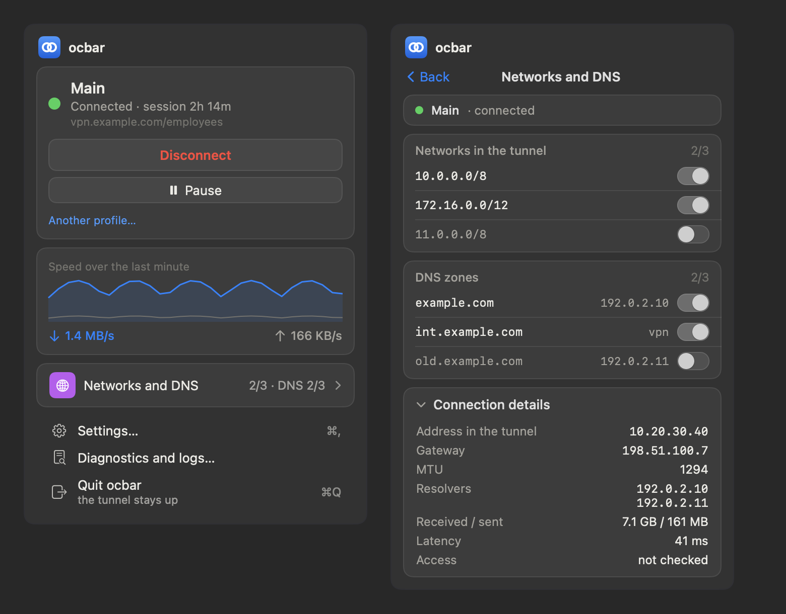
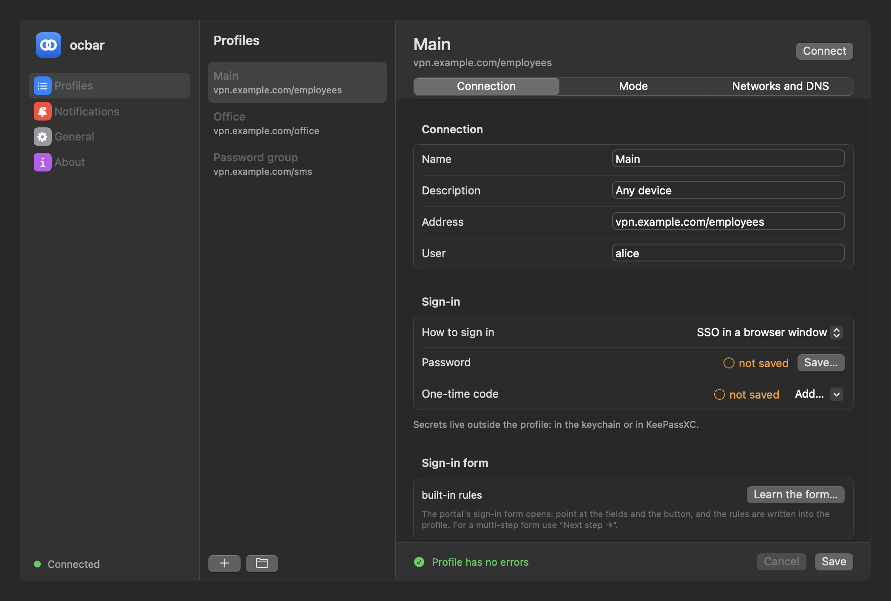
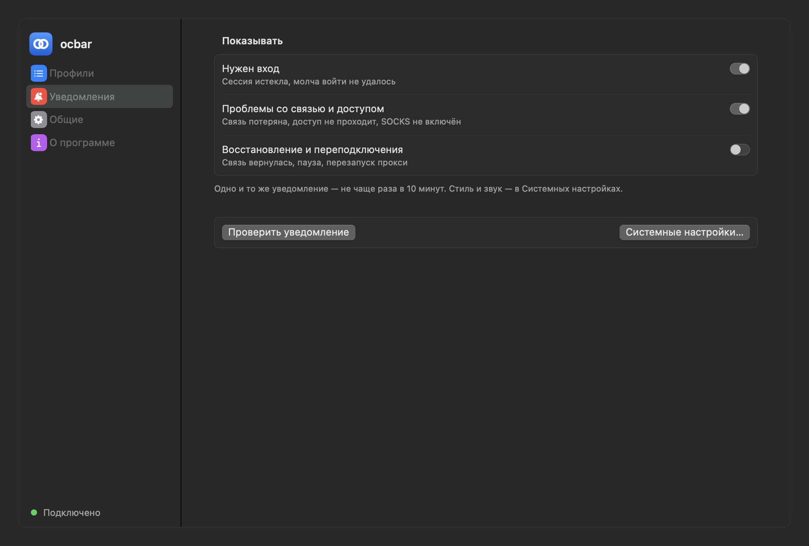

# ocbar

**English** · [Русский](README.ru.md)

A Cisco AnyConnect–compatible VPN client for macOS built on
[OpenConnect](https://www.infradead.org/openconnect/): SAML single sign-on in
a WebKit window with form autofill and TOTP, split DNS via `/etc/resolver`,
split tunneling you can change on a live connection, a supervisor that
reconnects after sleep and network changes, an unprivileged SOCKS proxy mode,
and a SwiftUI menu bar app. Installed from source through a Homebrew tap.



**Status:** 0.4 — a single-author tool used daily on a real AnyConnect gateway
with a Keycloak identity provider. The user interface and CLI messages are in
Russian; this README and the command reference are the English entry point.
Version history is in [CHANGELOG.md](CHANGELOG.md).

> Not affiliated with Cisco. "AnyConnect" is used only to describe protocol
> compatibility.

## Why

OpenConnect speaks the AnyConnect protocol, but on macOS the gaps are
everything around it: gateways that only allow SAML login, a
`vpnc-script` that routes all traffic and rewrites DNS, no reconnect after
sleep, and no menu bar UI. ocbar fills those gaps without a kernel extension,
a root daemon, or an Apple Developer ID.

## How it works

```
ocbar connect
  │
  ├─ ocbar-auth (Swift, WKWebView)        runs as the user
  │    init → SAML window → cookie → auth-reply → session token + server cert hash
  │
  └─ sudo -n ocbar-helper tunnel-start    root, the only NOPASSWD entry
       ├─ openconnect --cookie-on-stdin --script "ocbar-helper vpnc" -b
       └─ vpnc: ifconfig utunN, our routes, our /etc/resolver zones — nothing else

ocbar supervise (LaunchAgent)             runs as the user, every 5 s
       tunnel pid · kern.waketime · primary interface · routes in place
```

Privileged code lives in one file, [libexec/ocbar-helper](libexec/ocbar-helper):
fixed subcommands, every argument validated, state only in root-owned
directories, and it only touches what it created itself. See
[SECURITY.md](SECURITY.md) for the threat model.

## Features

- **SSO login** (`single-sign-on-v2`) in a WebKit window: the window stays
  hidden while a saved identity-provider session is enough, and appears only
  when a human is needed.
- **Autofill** with per-profile rules: username, password, TOTP, buttons,
  multi-step forms. Rules are recorded by clicking the form (`ocbar learn`) or
  by logging in once with "Remember how I sign in" (`ocbar connect --teach`).
  Filling happens only on HTTPS hosts of the login chain started by the
  gateway.
- **Secrets** from the macOS Keychain, KeePassXC (`keepassxc-cli`) or any
  command (e.g. `op item get … --otp`). TOTP secrets can be imported from
  `otpauth://` and Google Authenticator export QR codes, including via the Mac
  camera. Secrets never appear in process arguments.
- **Split tunneling and split DNS**: only listed networks go through the
  tunnel; DNS zones are added as `/etc/resolver` files. Both can be toggled
  on a live connection.
- **Pause**: remove routes and zones without dropping the session, resume
  instantly without logging in again (⌥⌘P).
- **Supervisor**: reconnects after sleep, network changes and dropped links;
  never opens a login window on its own; caps logins per hour.
- **Proxy mode**: `openconnect --script-tun` + `ocproxy` gives a local SOCKS
  proxy with no routes, no DNS changes and no root at all.
- **Menu bar app**: state, traffic, profile switching, network and zone
  toggles, profile editor, diagnostics, logs, notification settings, and a
  first-run wizard (system component → profile → first login).

## Try it without a VPN

The interface runs on synthetic data, so you can look before installing
anything that touches your network:

```bash
ocbar ui-lab                                              # menu states in a browser page
app/.build/ocbar.app/Contents/MacOS/ocbar-app --stage     # the real menu, every state at once
```

## Install

Requires macOS 13+ and Command Line Tools (full Xcode is not needed).

```bash
brew tap ValeraGin/ocbar
brew trust ValeraGin/ocbar            # third-party tap: Homebrew refuses untrusted formulae
brew install ocbar                    # builds from source on your machine
sudo ocbar install                    # once: helper, sudoers rule, LaunchAgent

mkdir -p ~/.config/ocbar/profiles
cp "$(brew --prefix ocbar)"/share/ocbar/examples/example.ocbar ~/.config/ocbar/profiles/main.ocbar
$EDITOR ~/.config/ocbar/profiles/main.ocbar

ocbar secret set-password
ocbar connect --show
ocbar app start && ocbar app autostart on
```

Why a source build: without a Developer ID a prebuilt app is quarantined by
Gatekeeper, while a locally built one is not. `brew upgrade ocbar` is the
update mechanism. Uninstall in this order: `sudo ocbar uninstall`, then
`brew uninstall ocbar` — otherwise the root helper and its sudoers rule stay
behind. Details (in Russian): [INSTALL.md](INSTALL.md).

## Profile





One file per connection, similar to WireGuard configs:
`~/.config/ocbar/profiles/<name>.ocbar`. No secrets inside — only references
to where they are stored, so a profile can be shared.

```ini
[Connection]
Name = Main
Url  = vpn.example.com/employees
User = alice

[Routes]
10.0.0.0/8
172.16.0.0/12

[DNS]
example.com      = 10.0.0.1
corp.example.com = vpn          # "vpn" = resolver pushed by the gateway

[Auth]
Password = keychain             # auto | keychain | keepassxc | command | ask
Totp     = keepassxc            # auto | keychain | keepassxc | command | sms | off
KeepassEntry = Group/Entry

[Health]
Check = wiki.example.com:443    # what must answer after connecting

[Autofill]
# step 1 — idp.example.com/login
fill  password input[id=password]
click button[type=submit]
# step 2 — idp.example.com/otp
fill  totp input[id=otp]
click input[id=kc-login]
```

Proxy mode instead of a tunnel:

```ini
[Connection]
Mode = proxy

[Proxy]
Port        = 11080
SystemProxy = off     # on — set this SOCKS on the active network service
```

```bash
brew install ocproxy
ocbar connect
curl --socks5-hostname 127.0.0.1:11080 https://wiki.example.com
```

A full annotated example: [etc/example.ocbar](etc/example.ocbar).

## Commands

```
ocbar connect [profile] [--show] [--teach] [-v]   log in and bring the tunnel up
ocbar disconnect
ocbar logout                          disconnect and forget identity-provider sessions
ocbar status [--short]
ocbar profiles | import <file> | export <profile> [file] | order [name…]
ocbar routes on|off|toggle <CIDR>     also: apply | clear | status
ocbar dns on|off|toggle <zone>        also: apply | clear | status
ocbar autoconnect [manual|resume|always <profile>] who brings the tunnel up
ocbar report [file] [--raw]           support report; hosts and logins masked
ocbar pause | resume | toggle
ocbar secret set-password|set-totp|status|code [profile]
ocbar secret import-qr <image> [--list] [--select NAME] [profile]
ocbar learn [profile] [--probe] [--out <file>]    record login form rules by clicking
ocbar rules show|import <file>|clear [profile]
ocbar app start|stop|status | autostart on|off | devmode on|off
ocbar supervisor status|start|stop|restart
ocbar doctor                          diagnostics, changes nothing
ocbar cleanup                         remove leftovers after a crash (only ours)
ocbar selftest
sudo ocbar install [--trust] | uninstall
--dry-run                             print privileged commands instead of running them
```

## Automation

There is no Shortcuts action yet, but the CLI is the automation interface —
use "Run Shell Script" in Shortcuts, or call it from anything else:

```bash
ocbar connect work && ocbar status --short   # key=value lines, easy to parse
ocbar pause; ocbar resume
ocbar autoconnect manual                     # stop the supervisor from logging in
```

Coming from Cisco Secure Client? `ocbar import profile.xml` reads the server
list from an AnyConnect XML profile and creates one `.ocbar` per server
(addresses only — routes, DNS and credentials stay yours to set).

## Self-tests

None of them needs a network or privileges: configs are synthetic, state and
logs go to a temporary directory, the helper is replaced by a stub.

```bash
ocbar selftest                  # CLI: profile parsing, rejections, cleanup, notifications
tools/helper-selftest.sh        # privileged helper on --dry-run with stubs
ocbar-auth --selftest           # TOTP (RFC 6238), XML, fill scope, limits, cookies
ocbar-auth --learn-selftest     # form recording and autofill on sample pages
ocbar-app --selftest            # profile read/write parity with the CLI, UI state
```

They run in CI on every push.

## Supported systems

| | Status |
|---|---|
| macOS 26, Apple Silicon | used daily by the author; CI builds and runs every self-test |
| macOS 13–25, Apple Silicon | expected to work (deployment target is macOS 13), not verified |
| Intel Macs | expected to work; Homebrew prefix is `/usr/local`, which the helper checks for ownership. Not verified |

No telemetry: ocbar never sends anything anywhere. It talks to your gateway
and identity provider, writes logs under `~/Library/Logs/ocbar`, and that is
all. There is no update check, no crash reporting, no analytics.

## Limitations

- Password groups (login + SMS OTP entered by a human) are not automated.
- Full tunnel is configured as `0.0.0.0/1` + `128.0.0.0/1`; there is no
  "route everything and rewrite system DNS" mode.
- IPv6 inside the tunnel: the address is set, routes are not.
- The Homebrew-installed shared libraries of `openconnect` stay in a
  user-writable prefix; the helper verifies their hashes, which catches
  accidental changes but not a targeted local attacker. See
  [SECURITY.md](SECURITY.md).

## License

MIT — see [LICENSE](LICENSE). Author: Valery Ignatkovich
([@ValeraGin](https://github.com/ValeraGin)).
